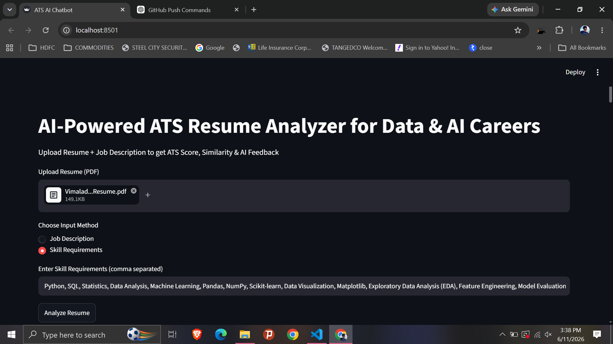
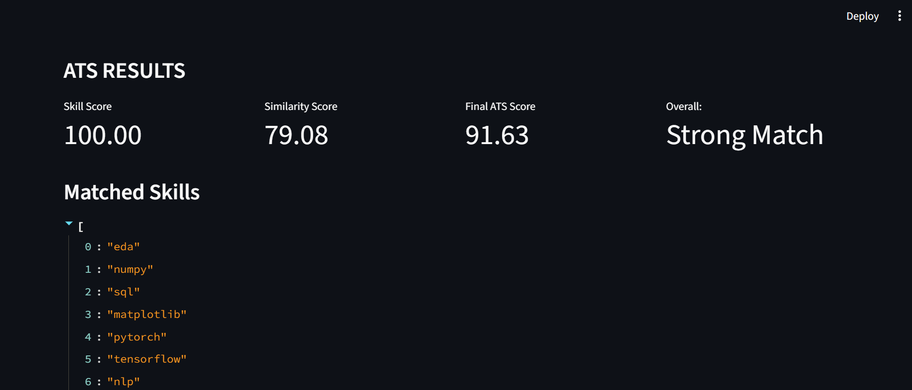
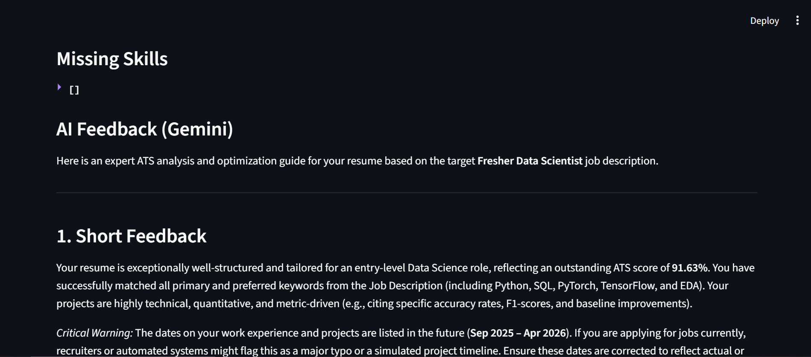
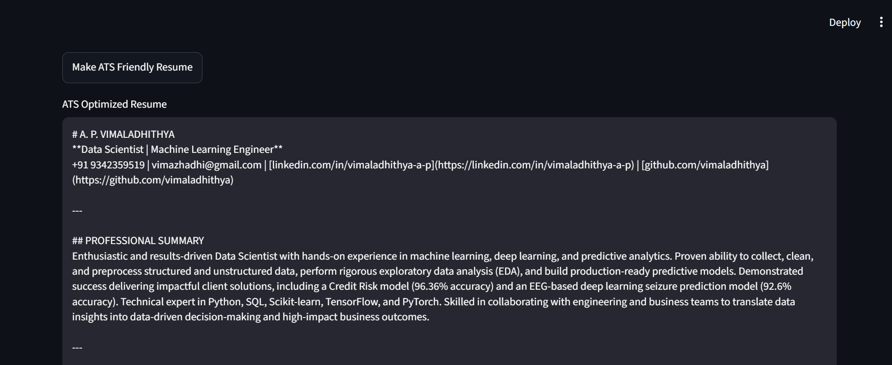
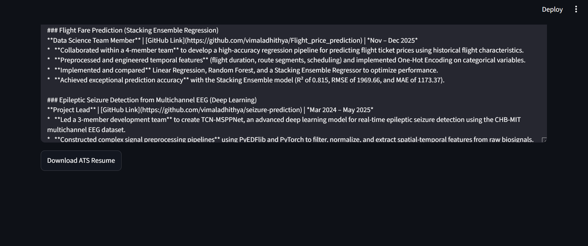

# ATS Score and Resume Optimizer 🚀

## 📌 Project Overview
ATS-Score-and-Resume-Optimizer is an AI-powered application that helps job seekers improve their resumes for Data & AI careers. It analyzes resumes for ATS compatibility, calculates ATS scores, and provides detailed feedback. Users can compare their resumes against either a full Job Description (JD) or a custom list of required skills. The system leverages NLP techniques, skill extraction, and Sentence Transformer-based semantic similarity to evaluate resume-job fit, identify skill gaps, and suggest targeted improvements. Additionally, it generates AI-powered resume optimization recommendations and allows users to download the enhanced resume as a PDF.
---

## ⚙️ Features
- Resume text extraction
- ATS score calculation
- Skill matching with job description
- Resume optimization using AI (Gemini API)
- Similarity scoring using Sentence Transformers

---

## 🧠 Tech Stack
- Python
- Streamlit
- Scikit-learn
- NLP (word_tokenize, stopwords, WordNetLemmatizer, SentenceTransformer, cosine_similarity)
- Google Gemini API

---

## 📂 Project Structure
- app.py → Main Streamlit app  
- ats_score.py → ATS scoring logic  
- gemini.py → AI resume optimization (Gemini API)  
- preprocess.py → Text cleaning and preprocessing  
- similarity.py → Matching logic using NLP  
- extract_text.py → Extracts text from resume files (PDF/DOCX)  
- final_score.py → Final ATS score calculation logic  
- optimize_resume_gemini.py → Resume optimization using Gemini AI  
- data/ → Skills dataset used for matching  
---

## 📸 Project Screenshots

### Home Page


### ATS Score Result


### AI Feedback


### Optimized Resume Output


### Resume Download


## 🚀 How to Run

```bash
pip install -r requirements.txt
streamlit run app.py